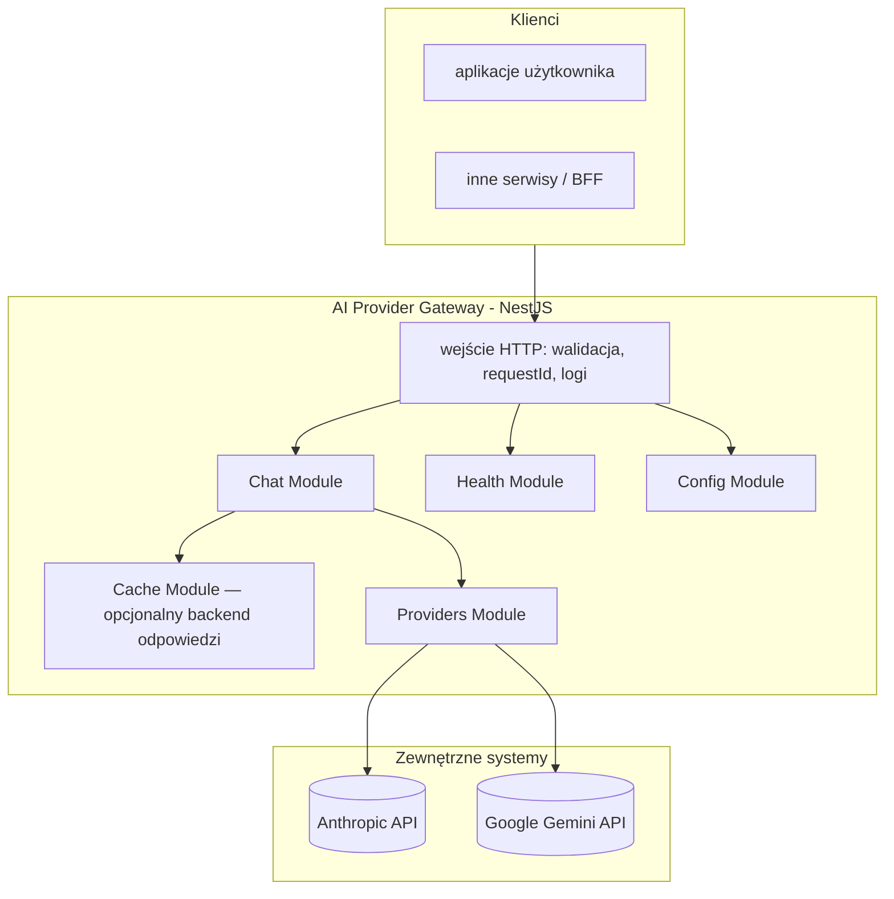

# Architektura — AI Provider Gateway

## Cel dokumentu

Opisuje **docelową architekturę** mikroserwisu “LLM Gateway”: granice modułów, warstwy odpowiedzialności, integracje z providerami oraz założenia operacyjne (konfiguracja, bezpieczeństwo, observability).

## Widok logiczny

## Moduły (bounded areas — rdzeń funkcjonalny)

| Moduł | Odpowiedzialność |
|------|------------------|
| **Chat** (`src/chat`) | Czat standardowy (`POST /api/v1/chat`) i streaming SSE (`POST /api/v1/chat/stream` — `ChatStreamController`). Orkiestracja wyboru modelu: składanie system promptu z plików (`MASTER` / `MAIN` / per alias), mapowanie `messages[]` na `user|assistant`, delegacja do adapterów. Dla czatu standardowego: opcjonalny odczyt/zapis odpowiedzi przez `ResponseCacheService` (`src/cache`). |
| **Cache** (`src/cache`) | Globalny moduł dynamiczny: rejestr backendów (`noop` zawsze, `redis` warunkowo), `ResponseCacheService` — cache wyłącznie dla **`POST /api/v1/chat`** (klucz m.in. z `modelAlias`, treści wiadomości i sygnatury warstw system promptu). Konfiguracja env: `docs/konfiguracja.md`. |
| **Providers** (`src/providers`) | Adaptery providerów (Anthropic/Google Gemini) + rejestr adapterów. Ukrywa SDK i szczegóły HTTP providerów. |
| **Config** (`src/config`) | Walidacja env + konfiguracja aplikacji (w tym ścieżki do plików konfiguracyjnych modeli/polityk). Fail‑fast przy starcie. |
| **Health** (`src/health`) | Liveness (`GET /api/v1/health`) i readiness (`GET /api/v1/health/ready` — config, Redis). Walidacja konfiguracji przy **starcie** procesu. |
| **Rate limit** (`src/rate-limit`) | Smart limiting per `X-Gateway-Key` (Redis): RPS/burst, równoległe streamy, cooldown po 429 od providera. |
| **Logging / Metrics** | Structured logging (Pino), opcjonalnie Sentry (błędy + spany LLM). |

## Warstwy wewnątrz modułów (konwencja NestJS)

1. **Controller** — mapowanie HTTP, statusy, nagłówki; brak logiki biznesowej i brak bezpośrednich wywołań SDK providerów. Limit rozmiaru body JSON: **`1mb`** (`express.json` w `src/main.ts`).
2. **Service (use case)** — orkiestracja: wybór modelu/trybu, polityki (timeout/retry), mapowanie parametrów, normalizacja błędów.
3. **Adapters (providers)** — tłumaczenie kontraktu gateway ↔ kontrakt SDK providera; obsługa błędów specyficznych dla SDK.
4. **DTO + walidacja** — walidacja wejścia i konfiguracji jako brzeg systemu.

### System prompt i wiadomości do adaptera

Kontrakt HTTP **nie** przyjmuje roli `system` w `messages[]` (walidacja DTO). Treść systemowa dla LLM jest **polityką gatewaya**: przy starcie wczytywane są pliki z `src/config/system-prompt/`, a w `ChatService` składane są warstwy:

- **MASTER** — wymagany plik `MASTER_SYSTEM_PROMPT.md`,
- **MAIN** — opcjonalny `MAIN_SYSTEM_PROMPT.md`,
- **per model** — opcjonalny `models/<modelAlias>.md` dla aliasu z `gateway.config.yaml`.

Łączenie sekcji: podwójna nowa linia (`\n\n`). Wynik trafia do portu providerów jako `ProviderChatInput.system`. Tablica `messages[]` w żądaniu zawiera wyłącznie **`user`** i **`assistant`** i jest mapowana na `ProviderChatTurn[]`.

W warstwie adaptera `system` z portu jest mapowany na natywne pole SDK providera:

- **Anthropic** (`@anthropic-ai/sdk`) — `messages.create({ system })`.
- **Google Gemini** (`@google/genai` 1.52+) — `config.systemInstruction` przekazywane do `ai.chats.create({ config })` lub `ai.models.generateContent({ config })`. Adapter dodatkowo mapuje rolę `assistant` na `model` (wymóg SDK Gemini). Szczegóły mapowania: `spec/SPEC-PROVIDERS.md`.

Szerszy kontekst warstw promptu: `konfiguracja.md`, `spec/SPEC-KONFIGURACJA.md` (tam, gdzie dotyczy plików promptu).

## Konfiguracja i sekrety

- Sekrety (klucze providerów) **wyłącznie** w env (`.env` lokalnie, w infrastrukturze użytkownika: menedżer sekretów).
- Przy starcie w **`NODE_ENV=production`** walidowane jest, że ustawiony jest **co najmniej jeden** klucz spośród `ANTHROPIC_API_KEY` i `GOOGLE_API_KEY` (`env.validation.ts`).
- Pliki konfiguracyjne opisują **modele, aliasy, limity i polityki** (bez wartości sekretów).
- Gateway uruchamia się w trybie “plug&play”: jeśli konfiguracja jest błędna → proces kończy się na starcie z czytelną informacją.
- **Ograniczenie konstrukcyjne — jedna instancja per typ providera.** W `gateway.config.yaml` w sekcji `providers` każdy `type` (`anthropic`, `google`, …) może wystąpić **co najwyżej raz**. Reguła egzekwowana fail-fast przy starcie przez `GatewayConfigSchema.providers.superRefine` w `src/config/configuration.ts`. Różnice między środowiskami (dev/staging/prod) wyrażamy **wartością** zmiennej środowiskowej wskazanej przez `apiKeyRef`, a nie przez deklarowanie wielu instancji tego samego typu w YAML.

Szczegóły: `konfiguracja.md`.

## Bezpieczeństwo (przegląd)

- Gateway nie jest “open proxy”: endpointy providerów są zaszyte w kodzie adapterów.
- Brak logowania sekretów: klucze i wrażliwe nagłówki są redagowane.
- Ustandaryzowane błędy nie zawierają surowych treści wyjątków SDK na produkcji.

Szczegóły: `architektura_api.md` + `anty-patterny.md`.

## Observability

- **Request ID**: `RequestIdMiddleware` — nagłówek `x-request-id` lub `req_<uuid>`; w envelope błędów i logach.
- **Logging**: `LoggingModule` (domyślnie Pino); opcjonalnie raportowanie błędów do Sentry.
- **Metryki LLM**: `MetricsService` + backend Sentry lub noop (latency, tokeny przy wywołaniach providera). Opcjonalne **`conversationId`** w żądaniu czatu grupuje spany w Sentry (`gen_ai.conversation.id`) — `docs/conversation-tracking.md`.
- **Graceful shutdown**: `SIGTERM` / `SIGINT` w `main.ts` (`app.close()`).

## Struktura repo (orientacyjnie)

Aktualna struktura katalogów źródłowych znajduje się w `README.md` repo oraz w `src/`.