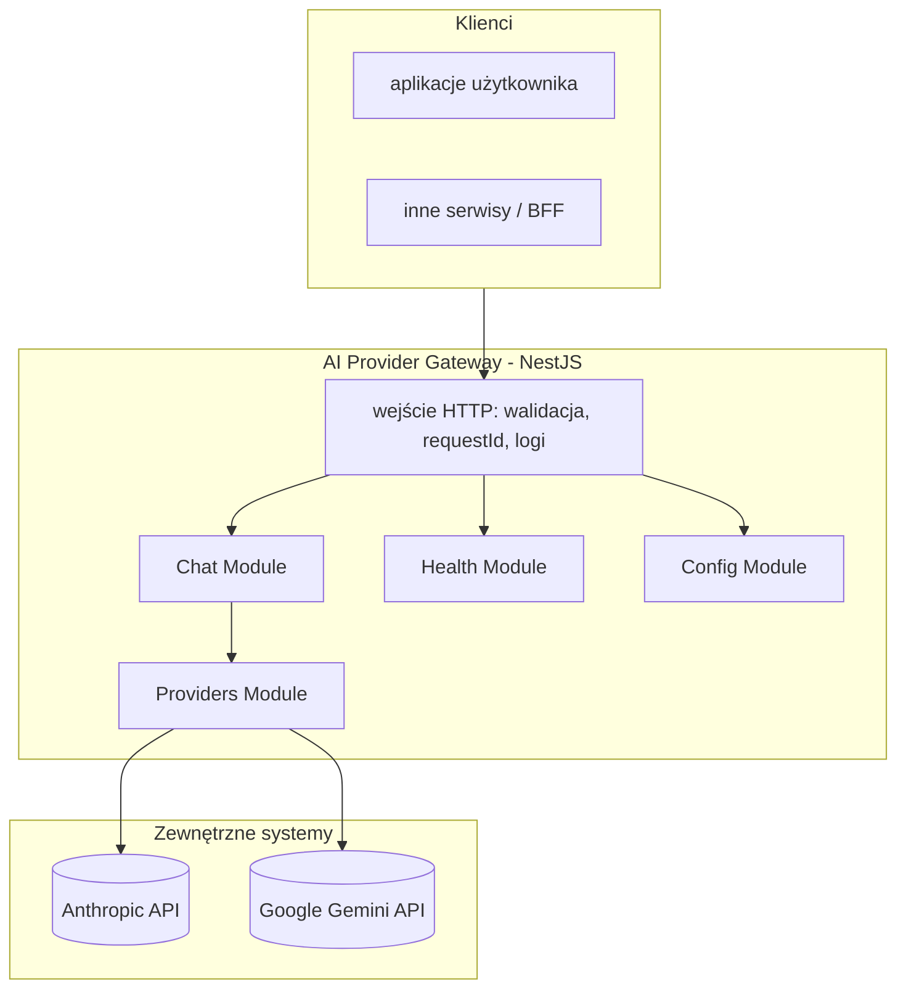

# Architektura — AI Provider Gateway

## Cel dokumentu

Opisuje **docelową architekturę** mikroserwisu “LLM Gateway”: granice modułów, warstwy odpowiedzialności, integracje z providerami oraz założenia operacyjne (konfiguracja, bezpieczeństwo, observability).

## Widok logiczny

## Moduły (bounded areas w skali MVP)

| Moduł | Odpowiedzialność |
|------|------------------|
| **Chat** (`src/chat`) | Czat standardowy (`POST /api/v1/chat`) i streaming SSE (`POST /api/v1/chat/stream` — `ChatStreamController`). Orkiestracja wyboru modelu i delegacja do providerów; normalizacja wiadomości (`normalizeMessagesForProvider`) i odpowiedzi. |
| **Providers** (`src/providers`) | Adaptery providerów (Anthropic/Google Gemini) + rejestr adapterów. Ukrywa SDK i szczegóły HTTP providerów. |
| **Config** (`src/config`) | Walidacja env + konfiguracja aplikacji (w tym ścieżki do plików konfiguracyjnych modeli/polityk). Fail‑fast przy starcie. |
| **Health** (`src/health`) | Liveness: `GET /api/v1/health` (JSON ze statusem i znacznikiem czasu). Osobny **readiness** (np. dependency check) — opcjonalnie w kolejnych iteracjach; walidacja konfiguracji następuje przy **starcie** procesu. |

## Warstwy wewnątrz modułów (konwencja NestJS)

1. **Controller** — mapowanie HTTP, statusy, nagłówki; brak logiki biznesowej i brak bezpośrednich wywołań SDK providerów.
2. **Service (use case)** — orkiestracja: wybór modelu/trybu, polityki (timeout/retry), mapowanie parametrów, normalizacja błędów.
3. **Adapters (providers)** — tłumaczenie kontraktu gateway ↔ kontrakt SDK providera; obsługa błędów specyficznych dla SDK.
4. **DTO + walidacja** — walidacja wejścia i konfiguracji jako brzeg systemu.

### Normalizacja wiadomości (rola `system`)

Gateway przyjmuje w kontrakcie HTTP `messages[]` z rolami `system|user|assistant`, ale przed wywołaniem adaptera normalizuje je do portu providerów:

- `system?: string` — agregacja wszystkich wiadomości systemowych,
- `messages[]` — wyłącznie `user|assistant`.

Powód: providerzy różnią się semantyką i kształtem pola `system` (np. Anthropic wymaga osobnego pola `system`, a nie roli `system` w `messages[]`), a gateway utrzymuje spójny kontrakt na wejściu.

W warstwie adaptera `system` z portu jest mapowany na natywne pole SDK providera:

- **Anthropic** (`@anthropic-ai/sdk`) — `messages.create({ system })`.
- **Google Gemini** (`@google/genai` 1.52+) — `config.systemInstruction` przekazywane do `ai.chats.create({ config })` lub `ai.models.generateContent({ config })`. Adapter dodatkowo mapuje rolę `assistant` na `model` (wymóg SDK Gemini). Szczegóły mapowania: `spec/SPEC-PROVIDERS.md`.

**Kierunek rozwoju:** plan `SYSTEM_PROMPTS_REFACTOR.md` przewiduje rezygnację z roli `system` w żądaniach HTTP na rzecz promptów wczytywanych z plików w repozytorium — po wdrożeniu niniejszą sekcję należy zastąpić opisem warstw MASTER / MAIN / per‑model.

## Konfiguracja i sekrety

- Sekrety (klucze providerów) **wyłącznie** w env (`.env` lokalnie, w infrastrukturze użytkownika: menedżer sekretów).
- Przy starcie w **`NODE_ENV=production`** walidowane jest, że ustawiony jest **co najmniej jeden** klucz spośród `ANTHROPIC_API_KEY` i `GOOGLE_API_KEY` (`env.validation.ts`).
- Pliki konfiguracyjne opisują **modele, aliasy, limity i polityki** (bez wartości sekretów).
- Gateway uruchamia się w trybie “plug&play”: jeśli konfiguracja jest błędna → proces kończy się na starcie z czytelną informacją.

Szczegóły: `konfiguracja.md`.

## Bezpieczeństwo (przegląd)

- Gateway nie jest “open proxy”: endpointy providerów są zaszyte w kodzie adapterów.
- Brak logowania sekretów: klucze i wrażliwe nagłówki są redagowane.
- Ustandaryzowane błędy nie zawierają surowych treści wyjątków SDK na produkcji.

Szczegóły: `architektura_api.md` + `anty-patterny.md`.

## Observability

- **Request ID**: nadawany lub propagowany z nagłówka, zwracany w błędach.
- Logi strukturalne na stdout (JSON preferowane).
- Metryki (kierunek po MVP): latency i błędy per provider, liczba tokenów.

## Struktura repo (orientacyjnie)

Aktualna struktura katalogów źródłowych znajduje się w `README.md` repo oraz w `src/`.