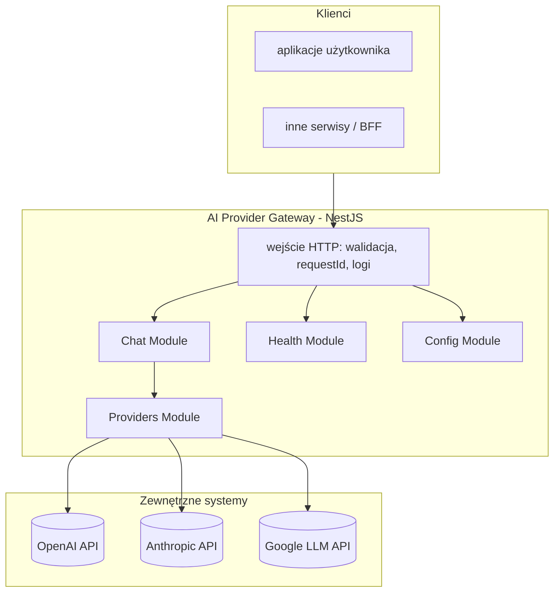

# Architektura — AI Provider Gateway

## Cel dokumentu

Opisuje **docelową architekturę** mikroserwisu “LLM Gateway”: granice modułów, warstwy odpowiedzialności, integracje z providerami oraz założenia operacyjne (konfiguracja, bezpieczeństwo, observability).

## Widok logiczny

## Moduły (bounded areas w skali MVP)

| Moduł | Odpowiedzialność |
|------|------------------|
| **Chat** (`src/chat`) | Dwa endpointy: standard i streaming. Orkiestracja wyboru modelu i delegacja do warstwy providerów. Normalizacja odpowiedzi. |
| **Providers** (`src/providers`) | Adaptery providerów (OpenAI/Anthropic/Google) + rejestr adapterów. Ukrywa SDK i szczegóły HTTP providerów. |
| **Config** (`src/config`) | Walidacja env + konfiguracja aplikacji (w tym ścieżki do plików konfiguracyjnych modeli/polityk). Fail‑fast przy starcie. |
| **Health** (`src/health`) | Liveness/readiness. Readiness uwzględnia stan konfiguracji oraz możliwość “wywołania” adapterów (na MVP: walidacja konfiguracji i zależności runtime). |

## Warstwy wewnątrz modułów (konwencja NestJS)

1. **Controller** — mapowanie HTTP, statusy, nagłówki; brak logiki biznesowej i brak bezpośrednich wywołań SDK providerów.
2. **Service (use case)** — orkiestracja: wybór modelu/trybu, polityki (timeout/retry), mapowanie parametrów, normalizacja błędów.
3. **Adapters (providers)** — tłumaczenie kontraktu gateway ↔ kontrakt SDK providera; obsługa błędów specyficznych dla SDK.
4. **DTO + walidacja** — walidacja wejścia i konfiguracji jako brzeg systemu.

## Konfiguracja i sekrety

- Sekrety (klucze providerów) **wyłącznie** w env (`.env` lokalnie, w infrastrukturze użytkownika: menedżer sekretów).
- Pliki konfiguracyjne opisują **modele, aliasy, limity i polityki** (bez wartości sekretów).
- Gateway uruchamia się w trybie “plug&play”: jeśli konfiguracja jest błędna → proces kończy się na starcie z czytelną informacją.

Szczegóły: `konfiguracja.md`.

## Bezpieczeństwo (przegląd)

- Gateway nie jest “open proxy”: endpointy providerów są zaszyte w kodzie adapterów.
- Brak logowania sekretów: klucze i wrażliwe nagłówki są redagowane.
- Ustandaryzowane błędy nie zawierają surowych treści wyjątków SDK na produkcji.

Szczegóły: `architektura_api.md` + `anty-patterny.md`.

## Observability

- **Request ID**: nadawany lub propagowany z nagłówka, zwracany w błędach.
- Logi strukturalne na stdout (JSON preferowane).
- Metryki (kierunek po MVP): latency i błędy per provider, liczba tokenów.

## Struktura repo (orientacyjnie)

Aktualna struktura katalogów źródłowych znajduje się w `README.md` repo oraz w `src/`.