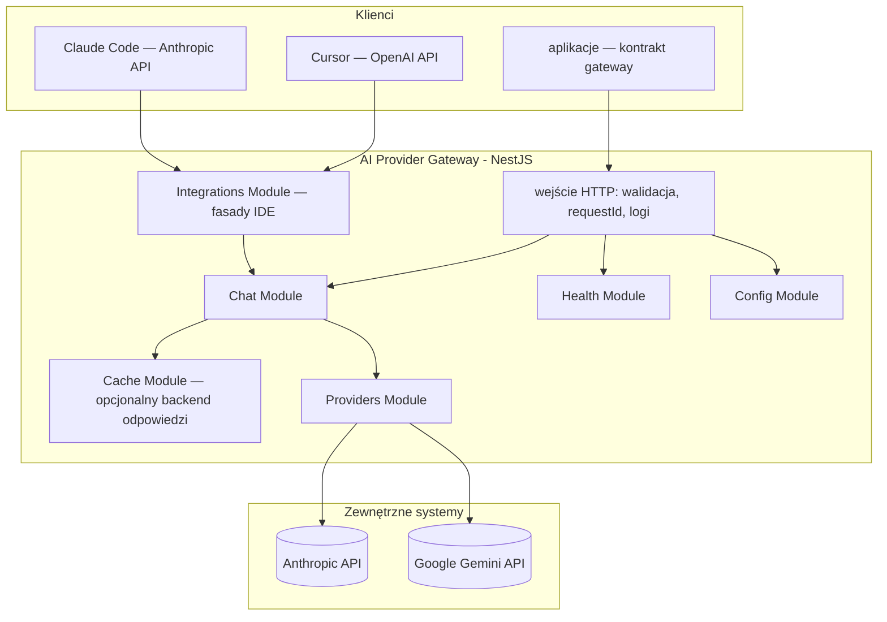

# Architektura — AI Provider Gateway

## Cel dokumentu

Opisuje **docelową architekturę** mikroserwisu “LLM Gateway”: granice modułów, warstwy odpowiedzialności, integracje z providerami oraz założenia operacyjne (konfiguracja, bezpieczeństwo, observability).

## Widok logiczny

## Moduły (bounded areas — rdzeń funkcjonalny)

| Moduł | Odpowiedzialność |
|------|------------------|
| **Chat** (`src/chat`) | Czat standardowy (`POST /api/v1/chat`) i streaming SSE (`POST /api/v1/chat/stream` — `ChatStreamController`). **`ChatService`**: cache, limity, `ResilientExecutor`, odpowiedź gateway. **`ChatProviderCallService`**: wywołania adapterów, metryki LLM, SSE `meta`/`delta`. Eksport **`ChatService`** i **`SmartRateLimitGuard`** dla fasad. System prompt z plików (`helpers/system-prompt.ts`); `messages[]` → port providerów (`helpers/provider-input.ts`). Cache tylko dla czatu standardowego (`ResponseCacheService`, `helpers/cache-policy.ts`). |
| **Integrations** (`src/integrations`) | Równoległe fasady **OpenAI API** (`/api/v1/openai/…`) i **Anthropic Messages API** (`/api/v1/anthropic/…`) dla IDE — mapowanie HTTP na `ChatService` bez duplikacji logiki providerów. Osobne guardy auth (Bearer / `x-api-key`), lokalne filtry błędów w kształcie vendora. **Stan:** obie fasady wdrożone (`integracje.md`). |
| **Cache** (`src/cache`) | Globalny moduł dynamiczny: rejestr backendów (`noop` zawsze, `redis` warunkowo), `ResponseCacheService` — cache wyłącznie dla **`POST /api/v1/chat`** (klucz m.in. z `modelAlias`, treści wiadomości i sygnatury warstw system promptu). Konfiguracja env: `docs/konfiguracja.md`. |
| **Providers** (`src/providers`) | Adaptery providerów (Anthropic/Google Gemini) + rejestr adapterów. Ukrywa SDK i szczegóły HTTP providerów. |
| **Config** (`src/config`) | Walidacja env + konfiguracja aplikacji (w tym ścieżki do plików konfiguracyjnych modeli/polityk). Fail‑fast przy starcie. |
| **Health** (`src/health`) | Liveness (`GET /api/v1/health`) i readiness (`GET /api/v1/health/ready` — `checks.config`, `checks.cache`). Walidacja konfiguracji przy **starcie** procesu. `checks.cache` dotyczy backendu **cache odpowiedzi** (`noop`/`redis`), nie osobnego probe smart rate limit (limitery używają tego samego `RedisConnectionService` gdy Redis jest załadowany — `RateLimitModule` → `RedisCacheModule`). |
| **Rate limit** (`src/rate-limit`) | Jedyna warstwa limitów gateway: smart limiting per `X-Gateway-Key` (Redis) — token bucket (RPS/burst), równoległe streamy, cooldown po 429 od providera (`SmartRateLimitGuard`, `SmartRateLimiterService`). Limity: opcjonalnie `clients[].rateLimit` w YAML, inaczej env; przełącznik `RATE_LIMIT_SMART_ENABLED`. Bez `@nestjs/throttler`. |
| **Logging / Metrics** | Structured logging (Pino), opcjonalnie Sentry (błędy + spany LLM). |
| **Swagger / OpenAPI** (`src/swagger`) | Dokumentacja HTTP generowana z dekoratorów `@nestjs/swagger` na kontrolerach i DTO. UI: `/api/v1/api-docs`, JSON: `/api/v1/swagger.json`; eksport statyczny: `npm run openapi:export` → `openapi.json`. |
| **CLI** (`src/cli`, `bin/`) | Narzędzie wiersza poleceń dla konfiguracji i operacji developerskich. **Osobny entry point** (`bin/gateway-cli-wrapper.js` → `CommandFactory.run(CliModule)`), **bez** importu `ConfigModule`. Reużywa schematy Zod z `src/config/`, ale ładuje YAML bez rozwiązywania env (`CliConfigLoaderService`). Faza 0: root command + utilities; komendy `gateway <namespace>:<action>` — w kolejnych fazach. Szczegóły struktury: `architektura-katalogi-pliki.md` (sekcja 2a). |

## CLI — izolacja od runtime HTTP

CLI i serwis HTTP współdzielą repozytorium, ale **nie ten sam bootstrap**:

Zasady (Faza 0):

- **CLI nie może wymagać `ConfigModule`** — tworzy pliki, których runtime potrzebuje przy starcie (deadlock).
- **CLI nie wymaga build** — wrapper używa `ts-node`, gdy brak `dist/bin/gateway-cli.js`.
- **Dozwolone importy:** typy, schematy, `validateGatewayConfig()` z `src/config/`; **zabronione:** modyfikacja logiki runtime przez warstwę CLI.
- **Walidacja:** wizard może generować niedokończony config; pełna walidacja (identyczna jak przy starcie aplikacji) — na końcu flow CLI *(plan, Faza 2)*.

Uruchomienie: `npm run cli` lub bin `gateway-cli` z `package.json`.

## Warstwy wewnątrz modułów (konwencja NestJS)

1. **Controller** — mapowanie HTTP, statusy, nagłówki; brak logiki biznesowej i brak bezpośrednich wywołań SDK providerów. Kontrolery fasad (`src/integrations/*/controllers/`) delegują wyłącznie do mapperów + `ChatService`. Limit rozmiaru body JSON: **`1mb`** (`express.json` w `src/main.ts`).
2. **Service (use case)** — **`ChatService`**: orkiestracja (cache, rate limit, `ResilientExecutor`, envelope odpowiedzi). **`ChatProviderCallService`**: pojedyncze wywołanie providera (`completeOnce` / `streamOnce`), `resolveProviderCallOptions`, metryki.
3. **Adapters (providers)** — tłumaczenie kontraktu gateway ↔ kontrakt SDK providera; obsługa błędów specyficznych dla SDK.
4. **DTO + walidacja** — walidacja wejścia i konfiguracji jako brzeg systemu.

### System prompt i wiadomości do adaptera

Kontrakt HTTP **nie** przyjmuje roli `system` w `messages[]` (walidacja DTO). Treść systemowa dla LLM jest **polityką gatewaya**: przy starcie wczytywane są pliki z `src/config/system-prompt/`, a w runtime składane są warstwy (`composeSystemPrompt` w `src/chat/helpers/system-prompt.ts`):

- **MASTER** — wymagany plik `MASTER_SYSTEM_PROMPT.md`,
- **MAIN** — opcjonalny `MAIN_SYSTEM_PROMPT.md`,
- **per model** — opcjonalny `models/<modelAlias>.md` dla aliasu z `gateway.config.yaml`.

Łączenie sekcji: podwójna nowa linia (`\n\n`). Wynik trafia do portu providerów jako `ProviderChatInput.system`. Tablica `messages[]` w żądaniu zawiera wyłącznie **`user`** i **`assistant`** i jest mapowana na `ProviderChatTurn[]`.

W warstwie adaptera `system` z portu jest mapowany na natywne pole SDK providera:

- **Anthropic** (`@anthropic-ai/sdk`) — `messages.create({ system })`.
- **Google Gemini** (`@google/genai` 1.52+) — `config.systemInstruction` przekazywane do `ai.chats.create({ config })` lub `ai.models.generateContent({ config })`. Adapter dodatkowo mapuje rolę `assistant` na `model` (wymóg SDK Gemini). Szczegóły mapowania: `spec/SPEC-PROVIDERS.md`.

Szerszy kontekst warstw promptu: `konfiguracja.md`, `spec/SPEC-KONFIGURACJA.md` (tam, gdzie dotyczy plików promptu).

## Konfiguracja i sekrety

- Sekrety (klucze providerów) **wyłącznie** w env (`.env` lokalnie, w infrastrukturze użytkownika: menedżer sekretów).
- Przy starcie w **`NODE_ENV=production`** walidowane jest, że ustawiony jest **co najmniej jeden** klucz spośród `ANTHROPIC_API_KEY` i `GOOGLE_API_KEY` (`env.validation.ts`).
- Pliki konfiguracyjne opisują **modele, aliasy, limity i polityki** (bez wartości sekretów).
- Gateway uruchamia się w trybie “plug&play”: jeśli konfiguracja jest błędna → proces kończy się na starcie z czytelną informacją.
- **Ograniczenie konstrukcyjne — jedna instancja per typ providera.** W `gateway.config.yaml` w sekcji `providers` każdy `type` (`anthropic`, `google`, …) może wystąpić **co najwyżej raz**. Reguła egzekwowana fail-fast przy starcie przez `GatewayConfigSchema.providers.superRefine` w `src/config/configuration.ts`. Różnice między środowiskami (dev/staging/prod) wyrażamy **wartością** zmiennej środowiskowej wskazanej przez `apiKeyRef`, a nie przez deklarowanie wielu instancji tego samego typu w YAML.
- **Spójność `providers` ↔ `models`.** Przy starcie wymuszany jest dwukierunkowy graf konfiguracji: niepuste `models`, każdy alias → istniejący `providerInstance`, każdy **włączony** provider → co najmniej jeden alias (Zod + `buildEffectiveGatewayConfig`). Szczegóły i wyjątki (`enabled: false`): `konfiguracja.md`, `spec/SPEC-KONFIGURACJA.md` (F-3b, F-3c).

Szczegóły: `konfiguracja.md`.

## Bezpieczeństwo (przegląd)

- Gateway nie jest “open proxy”: endpointy providerów są zaszyte w kodzie adapterów.
- **Dwa poziomy kluczy:** klient (IDE / aplikacja → allowlista gateway) vs provider (`.env` → SDK). Fasady używają tej samej allowlisty co `X-Gateway-Key`, ale innego nagłówka HTTP (`integracje.md`).
- Brak logowania sekretów: klucze i wrażliwe nagłówki są redagowane.
- Ustandaryzowane błędy nie zawierają surowych treści wyjątków SDK na produkcji (natywne API: `ErrorEnvelope`; fasady: format vendora).

Szczegóły: `architektura_api.md` + `anty-patterny.md` + `integracje.md`.

## Observability

- **Request ID**: `RequestIdMiddleware` — nagłówek żądania `x-request-id` (echo) lub `req_<uuid>`; to samo ID w body (`requestId`), envelope błędów, logach oraz **nagłówku odpowiedzi** `x-request-id`.
- **Logging**: `LoggingModule` (domyślnie Pino); opcjonalnie raportowanie błędów do Sentry.
- **Metryki LLM**: `MetricsService` + backend Sentry lub noop. **`conversationId` w request** grupuje spany (`gen_ai.conversation.id`); bez niego — pojedynczy span. Response zawsze zwraca ID sesji. Pełna treść wątku w Sentry wymaga pełnego `messages[]` od klienta — `docs/conversation-tracking.md`.
- **Graceful shutdown**: `SIGTERM` / `SIGINT` / `uncaughtException` / `unhandledRejection` w `main.ts` (`app.close()`).
- **OpenAPI**: dekoratory `@Api*` na kontrolerach (`ChatController`, `ChatStreamController`, `HealthController`) i DTO; wspólne dekoratory `ApiGatewayChatErrorResponses`, `ApiRequestIdHeader` w `src/common/decorators/`.

## Struktura repo (orientacyjnie)

Aktualna struktura katalogów źródłowych znajduje się w `README.md` repo oraz w `src/`.