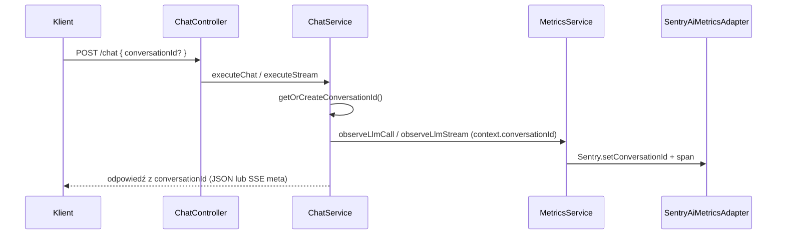

# Śledzenie rozmów (`conversationId`)

## Cel

Gateway obsługuje opcjonalne pole **`conversationId`** w body żądań czatu (`POST /api/v1/chat` i `POST /api/v1/chat/stream`). Służy ono do **grupowania metryk i spanów LLM** w Sentry AI Monitoring pod atrybutem `gen_ai.conversation.id` — bez utrzymywania historii rozmowy po stronie serwera.

Gateway pozostaje **stateless**: nie zapisuje konwersacji w bazie; identyfikator zarządza klient (lub przyjmuje ID wygenerowane przez gateway w pierwszej turze).

## Korzyści

- **Koszty i tokeny** — sumowanie zużycia w ramach jednej rozmowy w Sentry.
- **Debugowanie** — pełna ścieżka wielu wywołań LLM w jednej konwersacji.
- **Analityka produktowa** — długość rozmowy, wzorce retry, engagement (po stronie dashboardów Sentry).

## Kontrakt API

### Request

```json
{
  "modelAlias": "chat-default",
  "messages": [
    { "role": "user", "content": "Cześć" }
  ],
  "conversationId": "conv_123e4567-e89b-12d3-a456-426614174000"
}
```

| Pole | Wymagane | Opis |
|------|----------|------|
| `conversationId` | Nie | Dowolny niepusty string (zalecany UUID). Ten sam ID we wszystkich żądaniach jednej rozmowy grupuje metryki w Sentry. |

Walidacja (`ChatRequestDto`): `@IsOptional()`, `@IsString()`, `@MinLength(1)`. Pusty string `""` → **400** (`VALIDATION_FAILED`).

### Odpowiedź (echo do klienta)

Gateway **zwraca** użyte `conversationId`:

| Tryb | Gdzie |
|------|--------|
| Standard `POST /api/v1/chat` | Pole **`conversationId`** w JSON (`ChatResponse`) |
| Streaming `POST /api/v1/chat/stream` | Pole **`conversationId`** w pierwszym zdarzeniu SSE **`meta`** |

Zasady:

- Klient **podaje** `conversationId` → w odpowiedzi dostaje **to samo** (echo).
- Klient **nie podaje** → gateway generuje `conv_<uuid>` i **zwraca je** — front może zapamiętać i wysłać w kolejnych turach.

### Backward compatibility

Istniejący klient **bez zmian** może ignorować `conversationId` w odpowiedzi i wysyłać wyłącznie `modelAlias` + `messages` — każda tura bez ID w żądaniu dostanie nowe `conv_*` (brak grupowania między requestami w Sentry).

## Przepływ w kodzie



Implementacja: `src/chat/chat.service.ts`, `src/metrics/adapters/sentry-metrics.adapter.ts`. W środowisku bez Sentry (`NoopAiMetricsAdapter`, development) pole jest nadal zwracane do klienta; adapter metryk je ignoruje.

## Implementacja po stronie klienta

### Wzorzec: ID z pierwszej odpowiedzi gateway

```typescript
let conversationId: string | undefined;

async function sendMessage(messages: Message[]) {
  const res = await fetch('/api/v1/chat', {
    method: 'POST',
    headers: {
      'Content-Type': 'application/json',
      'X-Gateway-Key': process.env.GATEWAY_KEY!,
    },
    body: JSON.stringify({
      modelAlias: 'chat-default',
      messages,
      ...(conversationId ? { conversationId } : {}),
    }),
  });
  const data = await res.json();
  conversationId = data.conversationId ?? conversationId;
  return data;
}
```

### Wzorzec: ID generowane na froncie

```typescript
const [conversationId] = useState(() => crypto.randomUUID());
// ... wysyłaj conversationId w każdym requeście
```

### Streaming

Po `event: meta` odczytaj `data.conversationId` i używaj w kolejnych requestach stream / standard.

## Dobre praktyki

1. **Jedno ID na rozmowę** — własny UUID albo wartość z pierwszej odpowiedzi gateway.
2. **Reset przy nowym temacie** — nowe ID.
3. **Nie współdziel między użytkownikami**.

## Monitoring w Sentry

Przy włączonym backendzie Sentry (`SENTRY_DSN`, `METRICS_BACKEND=sentry` lub `NODE_ENV=production`):

- Filtruj spany `op = gen_ai.chat` po **`gen_ai.conversation.id`**.
- Ten sam `conversationId` w wielu requestach = jedna rozmowa w metrykach.

## FAQ

**Czy `conversationId` jest wymagane w żądaniu?**  
Nie. Możesz zacząć bez niego i brać ID z odpowiedzi.

**Czy gateway przechowuje historię?**  
Nie. Klient wysyła pełną tablicę `messages[]` (do 50).

**Czy streaming wspiera `conversationId`?**  
Tak — w body (request) i w SSE `meta` (response).

Powiązane: `openapi.json` (`ChatRequest`, `ChatResponse`, `SseMetaPayload`), `dokumentacja_api.md`, `data_flow.md`.
