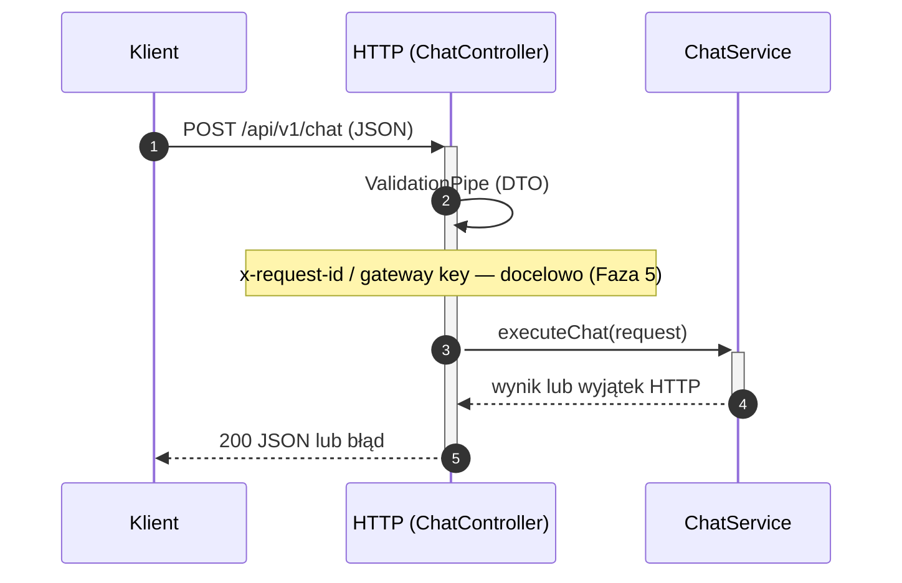
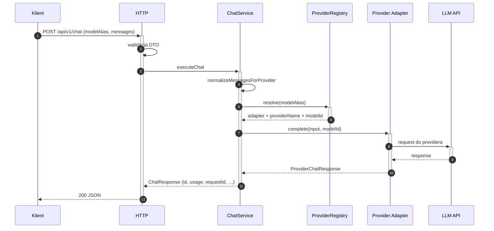
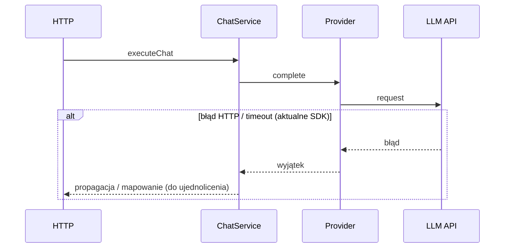
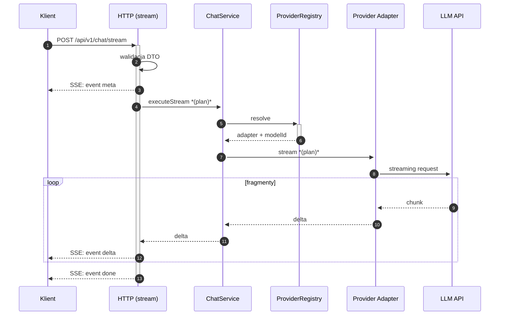

# Przepływ danych (data flow) — AI Provider Gateway

Dokument uzupełnia `dokumentacja_api.md` i `architektura.md`: pokazuje kierunek danych między klientem, warstwą HTTP (NestJS), logiką aplikacyjną oraz adapterami providerów.

**Konfiguracja:** przy starcie ładowany jest `gateway.config.yaml` (`src/config/configuration.ts`). Env: w **production** wymagany jest co najmniej jeden niepusty klucz spośród `ANTHROPIC_API_KEY` i `GOOGLE_API_KEY` (`src/config/env.validation.ts`).

## Legenda uczestników

| Skrót | Znaczenie |
|-------|-----------|
| **Klient** | Dowolny klient HTTP (aplikacja, serwis, BFF). |
| **HTTP** | Kontroler + walidacja DTO + odpowiedź. |
| **ChatService** | Resolve aliasu, normalizacja wiadomości, wywołanie adaptera. |
| **Registry** | `ProviderRegistryService` — mapowanie aliasu z YAML na adapter + `modelId`. |
| **Provider** | Adapter Anthropic / Google. |
| **LLM API** | Zewnętrzny serwis providera. |

---

## 0. Wspólny szkielet: walidacja, wybór modelu

---

## 1. Standard `POST /api/v1/chat` — sukces (200)

**Uwaga:** opcjonalne `params` z kontraktu OpenAPI nie są jeszcze w DTO — nie występują w tym przepływie.

---

## 2. Standard `POST /api/v1/chat` — błąd (plan kontraktu)

Docelowo (Faza 5 + mapowanie w adapterach): 429 / timeout / 5xx mają być mapowane na envelope z polami `code` i `requestId` (`openapi.json`, `dictionary.md`).  
**Dziś:** zachowanie zależy od wyjątków Nest/SDK — konsument powinien traktować to jako przejściowe do czasu ujednolicenia.

---

## 3. Streaming `POST /api/v1/chat/stream` — sukces (SSE) *(plan)*

Kontrakt i diagram docelowy są zgodne z `openapi.json` i **Fazą 4** (`PLAN_IMPLEMENTACJI.md`). Implementacja **nie jest jeszcze podłączona** pod ścieżkę z OpenAPI.

---

Powiązane: `openapi.json`, `dokumentacja_api.md`, `architektura.md`, `PLAN_IMPLEMENTACJI.md`.
