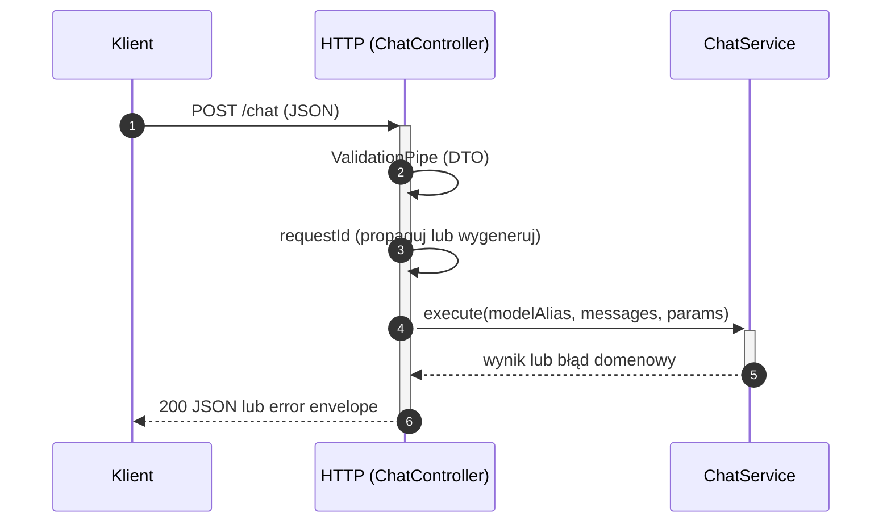
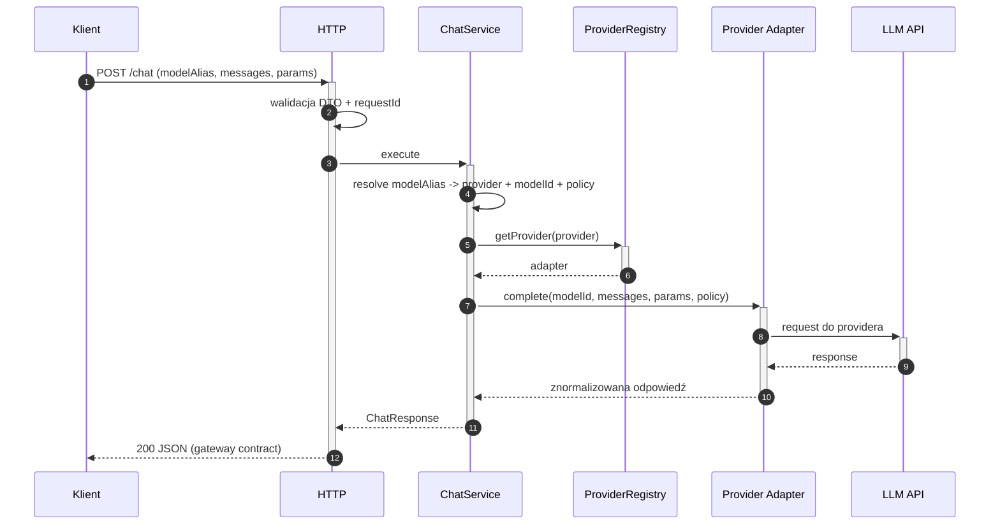
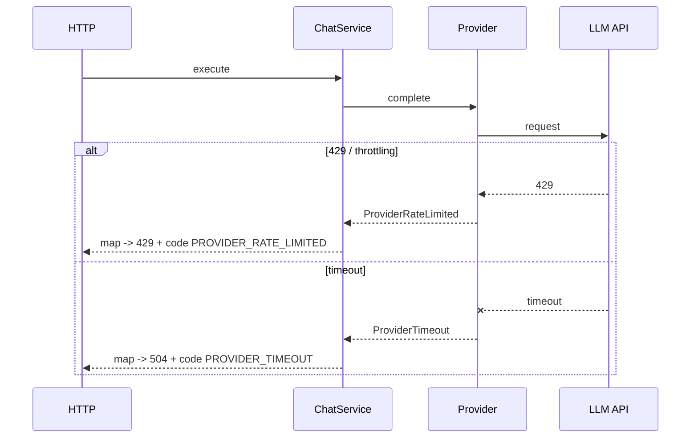
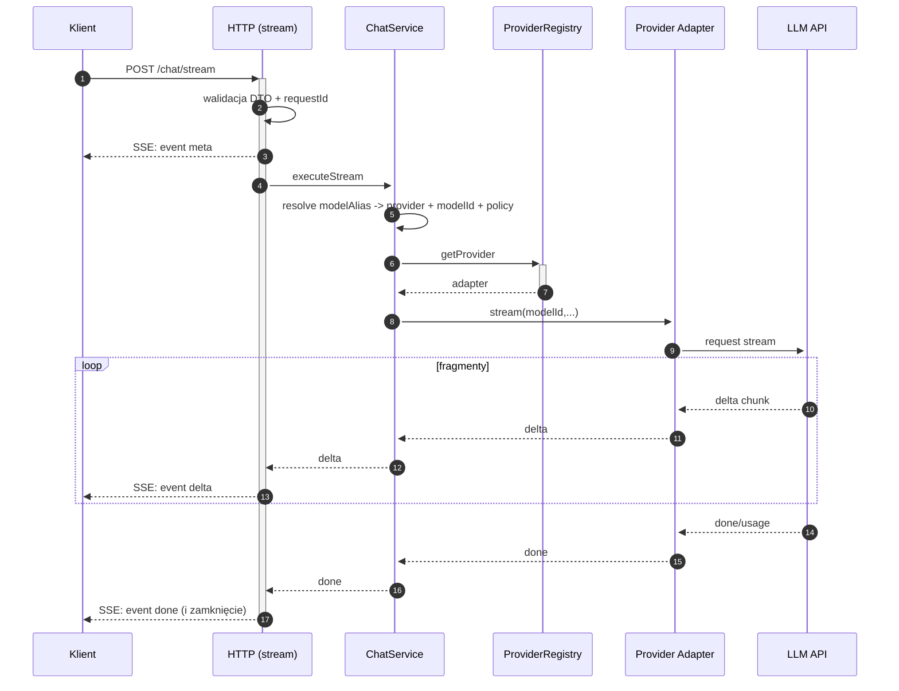

# Przepływ danych (data flow) — AI Provider Gateway

Dokument uzupełnia `dokumentacja_api.md` i `architektura.md`: pokazuje kierunek danych między klientem, warstwą HTTP (NestJS), logiką aplikacyjną oraz adapterami providerów.

## Legenda uczestników

| Skrót | Znaczenie |
|-------|-----------|
| **Klient** | Dowolny klient HTTP (aplikacja, serwis, BFF). |
| **HTTP** | Kontroler + walidacja DTO + response mapping. |
| **ChatService** | Przypadek użycia: resolve aliasu, polityki, wywołanie providera. |
| **Registry** | Rejestr adapterów providerów (DI). |
| **Provider** | Adapter: OpenAI / Anthropic / Google. |
| **LLM API** | Zewnętrzny serwis providera. |

---

## 0. Wspólny szkielet: requestId, walidacja, wybór modelu

---

## 1. Standard `POST /chat` — sukces (200)

---

## 2. Standard `POST /chat` — błąd (np. 429 / timeout)

---

## 3. Streaming `POST /chat/stream` — sukces (SSE)

---

Powiązane: `dokumentacja_api.md`, `architektura.md`, `anty-patterny.md`.

