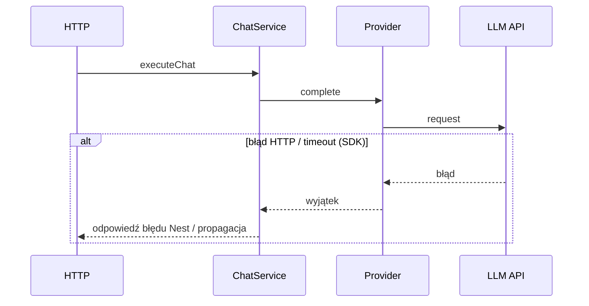
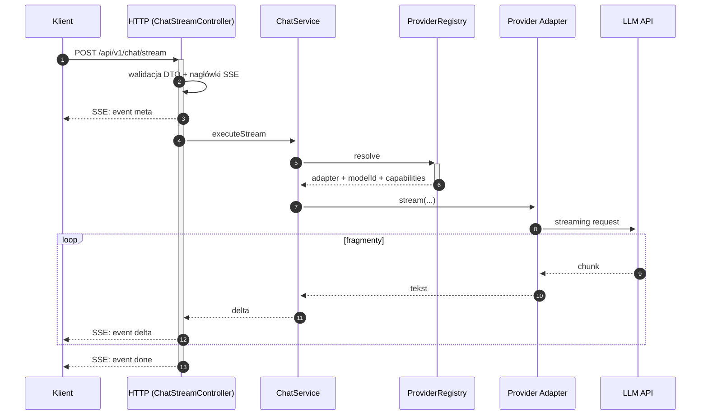

# Przepływ danych (data flow) — AI Provider Gateway

Dokument uzupełnia `dokumentacja_api.md` i `architektura.md`: pokazuje kierunek danych między klientem, warstwą HTTP (NestJS), logiką aplikacyjną oraz adapterami providerów.

**Konfiguracja:** przy starcie ładowany jest `gateway.config.yaml` (`src/config/configuration.ts`). Env: w **production** wymagany jest co najmniej jeden niepusty klucz spośród `ANTHROPIC_API_KEY` i `GOOGLE_API_KEY` (`src/config/env.validation.ts`).

## Legenda uczestników

| Skrót | Znaczenie |
|-------|-----------|
| **Klient** | Dowolny klient HTTP (aplikacja, serwis, BFF). |
| **HTTP** | Kontroler + walidacja DTO + odpowiedź. |
| **ChatService** | Resolve aliasu, składanie system promptu z konfiguracji, mapowanie `messages[]` na `user|assistant`, wywołanie adaptera. |
| **Registry** | `ProviderRegistryService` — mapowanie aliasu z YAML na adapter + `modelId`. |
| **Provider** | Adapter Anthropic / Google. |
| **LLM API** | Zewnętrzny serwis providera. |

---

## 0. Wspólny szkielet: walidacja, wybór modelu

```mermaid
sequenceDiagram
  autonumber
  participant K as Klient
  participant H as HTTP (ChatController)
  participant S as ChatService

  K->>+H: POST /api/v1/chat (JSON)
  H->>H: ValidationPipe (DTO)
  Note over H: x-request-id propagation aktywna (RequestIdInterceptor); gateway key X-Gateway-Key — Faza 5; stream: ChatStreamController
  H->>+S: executeChat(request)
  S-->>-H: wynik lub wyjątek HTTP
  H-->>-K: 200 JSON lub błąd
```

---

## 1. Standard `POST /api/v1/chat` — sukces (200)


**Uwaga:** body **`params`** nie jest częścią DTO — wartości wyjścia pochodzą z konfiguracji aliasu (`gateway.config.yaml`).

---

## 2. Standard `POST /api/v1/chat` — błąd

Odpowiedzi JSON błędów są w envelope **`ErrorEnvelope`** (`openapi.json`) z polami `{statusCode, code, message, requestId, details?}` — `GlobalExceptionFilter` (global). Aktualny mapping `code` ze statusu HTTP jest minimalistyczny (5 wartości); pełne mapowanie kodów providerów na docelowy słownik (`dictionary.md`) — **Faza 5** (Krok 5.1b).



---

## 3. Streaming `POST /api/v1/chat/stream` — sukces (SSE)

Zgodnie z `openapi.json` i kodem (`ChatStreamController`, `ChatService.executeStream`): nagłówki SSE, potem `meta`, `delta`, `done` (`done` z pustym `data`).



---

Powiązane: `openapi.json`, `dokumentacja_api.md`, `architektura.md`, `PLAN_IMPLEMENTACJI.md`, `REDIS_IMPLEMENTATION_PLAN.md` (opcjonalny cache — plan).
