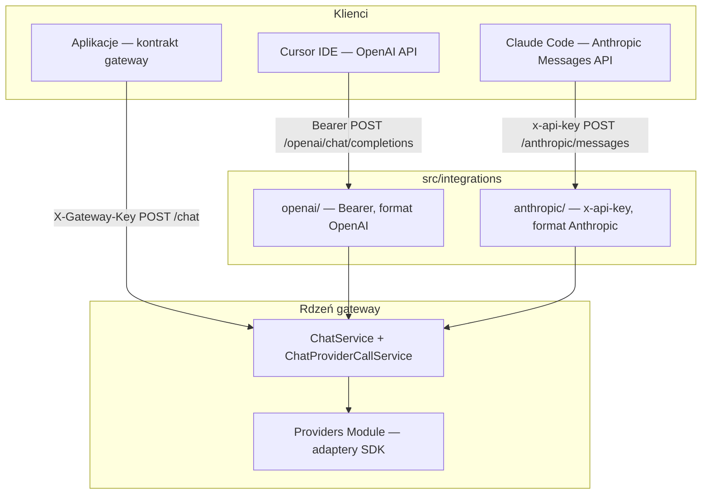

# Fasady integracji (IDE) — AI Provider Gateway

Moduł **`src/integrations/`** dodaje **równoległe kontrakty HTTP** dla narzędzi, które oczekują natywnego API vendora (OpenAI lub Anthropic), bez zmiany rdzenia gatewaya (`POST /api/v1/chat`, adaptery w `src/providers/`).

## Filozofia

| Zasada | Opis |
|--------|------|
| **Trzy kontrakty, jeden silnik** | Kontrolery i mappery tłumaczą HTTP; **`ChatService`** pozostaje jedynym orchestratorem (cache, retry, fallback, limity). |
| **Anti-corruption layer** | Podmoduły `openai/` i `anthropic/` są izolowane — zmiana formatu OpenAI nie wpływa na Messages API. |
| **Bez zmiany natywnego API** | `ChatController` / `ChatStreamController` i adaptery providerów pozostają punktem odniesienia dla aplikacji pisanych pod kontrakt gateway. |
| **Separacja kluczy** | Klucze **klientów** (IDE → gateway) ≠ klucze **providerów** (gateway → LLM w `.env`). |

## Stan wdrożenia

| Element | Status |
|---------|--------|
| Szkielet katalogów `src/integrations/{openai,anthropic}/` | W repozytorium |
| `IntegrationsModule` w `AppModule` | Zarejestrowany |
| `Request.gatewayKey` w `src/common/types/express.d.ts` | W repozytorium |
| Eksport `ChatService`, `SmartRateLimitGuard` z `ChatModule` | W repozytorium |
| `readClientGatewayKey` + aktualizacja `SmartRateLimitGuard` / `StreamCleanupInterceptor` | W repozytorium |
| **Fasada OpenAI** (`OpenAiModule`) — auth, models, completions JSON + stream | **Wdrożona** — [`integracja-openai-kontrakt.md`](integracja-openai-kontrakt.md) |
| **Fasada Anthropic** (`AnthropicModule`) — auth, models, messages JSON + stream | **Wdrożona** — [`integracja-anthropic-messages.md`](integracja-anthropic-messages.md) |

Szczegóły konfiguracji klientów (Cursor, Claude Code): **`integracja-openai-kontrakt.md`**, **`integracja-anthropic-messages.md`**.

## Widok architektury



## Trzy powierzchnie API

Globalny prefiks aplikacji: **`/api/v1`** (`src/main.ts`).

| Powierzchnia | Base URL (przykład) | Auth klienta | Główne trasy |
|--------------|---------------------|--------------|--------------|
| **Natywna** | `http://host:3000/api/v1` | `X-Gateway-Key` | `POST /chat`, `POST /chat/stream` |
| **OpenAI** | `http://host:3000/api/v1/openai` | `Authorization: Bearer <klucz_klienta>` | `GET /models`, `POST /chat/completions` |
| **Anthropic** | `http://host:3000/api/v1/anthropic` | `x-api-key` (lub Bearer) | `GET /models`, `POST /messages` |

IDE ustawia **Base URL** z segmentem integracji; klient dokleja ścieżki ze specyfikacji vendora (`/models`, `/chat/completions`, `/messages`) — ten sam wzorzec co `https://api.openai.com/v1` + `/chat/completions`.

**Świadomie brak** wspólnej trasy `GET /api/v1/models` — OpenAI i Anthropic mają różny kształt listy modeli.

Stałe ścieżek (docelowo w `src/integrations/integrations.constants.ts`):

- `OPENAI_INTEGRATION_PATH = 'openai'`
- `ANTHROPIC_INTEGRATION_PATH = 'anthropic'`

## Mapowanie modeli

Pole **`model`** w żądaniu fasady (OpenAI / Anthropic) = **`modelAlias`** z `gateway.config.yaml` (np. `chat-default`, `claude-sonnet`). Vendorowy `modelId` pozostaje w konfiguracji; klient IDE nie podaje go bezpośrednio.

`GET .../models` zwraca aliasy włączone w YAML (provider instancji `enabled !== false`), w formacie JSON odpowiedniego standardu.

## Autoryzacja — dwa poziomy

### Klucze klientów (frontend / IDE → gateway)

Wszystkie trzy powierzchnie weryfikują **tę samą allowlistę** (`gatewayKey.allowList` z `.env` / `gateway.config.yaml`):

| Powierzchnia | Nagłówek | Guard (docelowo) |
|--------------|----------|------------------|
| Natywna | `X-Gateway-Key` | `GatewayKeyGuard` |
| OpenAI | `Authorization: Bearer` | `OpenAiBearerAuthGuard` → `req.gatewayKey` |
| Anthropic | `x-api-key` (priorytet) lub Bearer | `AnthropicApiKeyGuard` → `req.gatewayKey` |

Kody błędów wewnętrzne (`GATEWAY_KEY_MISSING`, `GATEWAY_KEY_INVALID`) są mapowane na format OpenAI (`error.type`) lub Anthropic w **lokalnych filtrach** (`OpenAiExceptionFilter`, `AnthropicExceptionFilter`). `GlobalExceptionFilter` nadal obsługuje natywne API.

### Klucze providerów (gateway → LLM)

Adaptery w `src/providers/` używają wyłącznie `ANTHROPIC_API_KEY`, `GOOGLE_API_KEY` itd. z `.env` — **nigdy** klucza klienta z IDE.

## Smart rate limit

Fasady muszą współdzielić **`SmartRateLimiterService`** z natywnym API.

**Kolejność guardów (wymagana):**

1. Guard auth fasady (ustawia `req.gatewayKey`)
2. `SmartRateLimitGuard` (token bucket RPS, cooldown)

**Helper `readClientGatewayKey(req)`** (docelowo `src/common/readClientGatewayKey.ts`):

- integracje: `req.gatewayKey` po guardzie fasady,
- natywne API: `X-Gateway-Key` (`readGatewayKeyHeader`) — bez regresji.

**Równoległe streamy:** natywny `POST /chat/stream` — `SmartRateLimitGuard` (URL kończy się na `/stream`) + `StreamCleanupInterceptor`. Fasady OpenAI / Anthropic (`stream: true` w body) — **rezerwacja i zwolnienie slotu w kontrolerze fasady** (guard nie parsuje body `stream`).

## Przepływ żądania (docelowy)

1. HTTP → kontroler fasady + walidacja DTO vendora.
2. Mapper request → `ChatRequestDto` (`modelAlias`, `messages`, opcjonalnie `params`).
3. `ChatService.executeChat` / `executeStream` z `req.gatewayKey` i `req.requestId`.
4. Mapper response / stream → format OpenAI lub Anthropic.
5. Pola specyficzne dla gateway (`provider`, `cached`, `conversationId`) **nie** są eksponowane w fasadach MVP.

## Streaming

| API | Format strumienia |
|-----|-------------------|
| Natywny | SSE gateway: `meta` → `delta` → `done` |
| OpenAI | SSE zgodny z OpenAI Chat Completions (`data: {...}`) |
| Anthropic | SSE zgodny z Anthropic Messages (zdarzenia `message_start`, `content_block_delta`, …) |

Wewnętrznie fasady korzystają z `ChatProviderCallService.streamOnce` i mapują zdarzenia gateway na format vendora.

## Błędy i filtry

- **Natywne API:** `GlobalExceptionFilter` → `ErrorEnvelope`.
- **Fasady:** lokalne filtry na kontrolerach (`@OpenAiAuth()`, `@AnthropicAuth()`) — kształt JSON jak u vendora, z zachowaniem nagłówka **`x-request-id`**.

## Ograniczenia MVP fasad

| Temat | Decyzja |
|-------|---------|
| `system` w messages klienta | Ignorowane — prompt z `src/config/system-prompt/` |
| Tools / function calling | Nieobsługiwane |
| Multimodal (obrazy) | Nieobsługiwane — 400 przy blokach `image` |
| Cache odpowiedzi | Działa przez `ChatService` dla wywołań non-stream; pola `cached` ukryte w odpowiedzi fasady |
| OpenAPI / Swagger | Docelowo osobne tagi; obecnie kontrakt natywny w `openapi.json` |

## Struktura plików

```
src/integrations/
├── integrations.module.ts
├── integrations.constants.ts
├── openai/
│   ├── controllers/     # models, chat/completions
│   ├── services/        # orchestration, models catalog
│   ├── mappers/         # request, response, stream
│   ├── guards/          # Bearer auth
│   ├── filters/         # OpenAI-shaped errors
│   ├── decorators/      # @OpenAiAuth()
│   └── dtos/
└── anthropic/
    ├── controllers/     # models, messages
    ├── services/
    ├── mappers/
    ├── guards/          # x-api-key auth
    ├── filters/
    ├── decorators/      # @AnthropicAuth()
    └── dtos/
```

## Powiązane dokumenty

- `integracja-openai-kontrakt.md` — konfiguracja Cursor IDE
- `integracja-anthropic-messages.md` — konfiguracja Claude Code
- `lista_endpointów.md` — pełna lista tras (w tym fasady)
- `data_flow.md` — diagramy przepływu
- `architektura.md`, `architektura-katalogi-pliki.md`
- `dictionary.md` — pojęcia (fasada, klucz klienta)
- `anty-patterny.md` — pułapki przy wielu kontraktach
